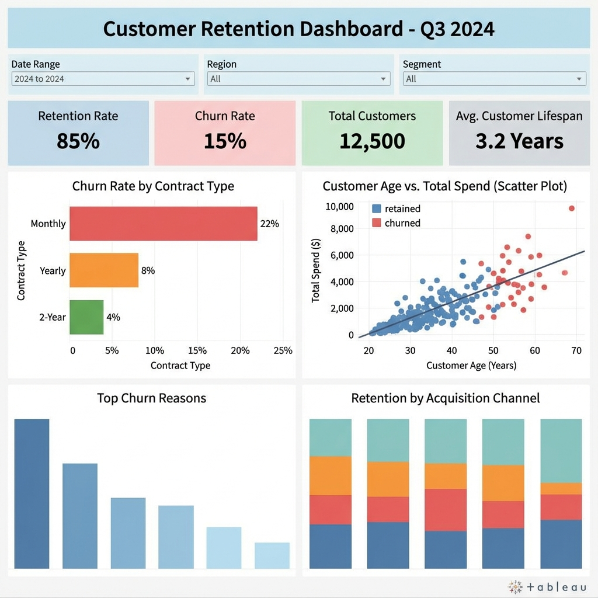

# Business Intelligence Dashboards

This section showcases interactive dashboards built to provide real-time insights for executive stakeholders.

## 1. Executive Sales Dashboard (Power BI)

### 🎯 Business Goal
Provide the C-Suite with a real-time view of global sales performance, allowing drill-down by Region and Product Category.

### 🛠 Key Features (DAX)
- **Time Intelligence**: `CALCULATE([Total Revenue], SAMEPERIODLASTYEAR('Date'[Date]))` to track YoY Growth.
- **Dynamic Title**: Changes based on the selected Slicer (e.g., "Sales Performance - North America").
- **Drill-Through**: Users can click a "Region" bar to see a detailed list of transactions for that region.

---

## 2. Operations Performance Dashboard (Tableau)

### 🎯 Business Goal
To monitor operational health, focusing on Customer Retention and Support Efficiency.

### 🛠 Key Features
- **Parameters**: "What-If" analysis allowing users to adjust the projected "Churn Rate" to see revenue impact.
- **LOD Expressions**: `FIXED [CustomerID]: MAX([OrderDate])` to find the most recent purchase per user.
- **Dual Axis Charts**: combining "Total Calls" (Bar) and "Avg Handling Time" (Line) to spot ongoing support issues.
