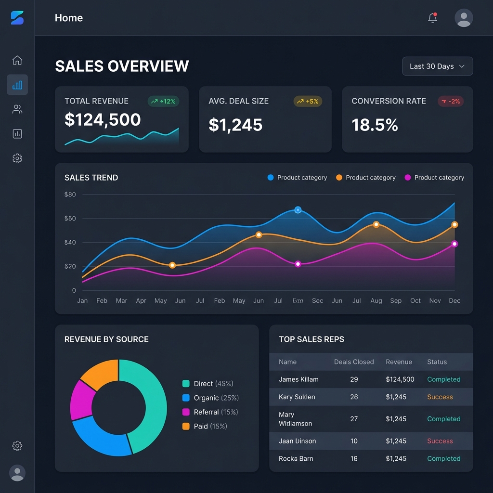
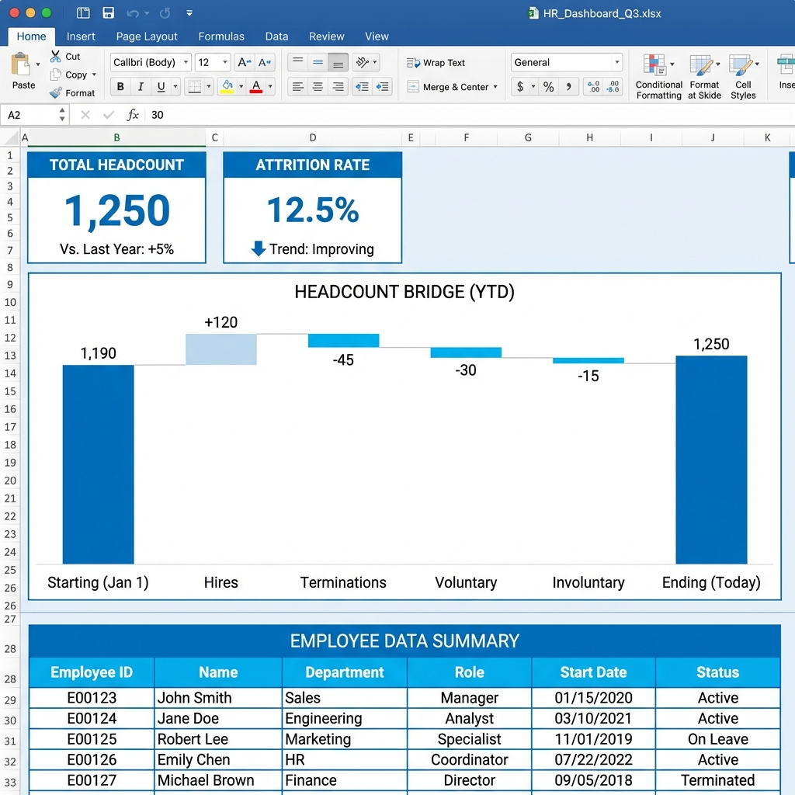
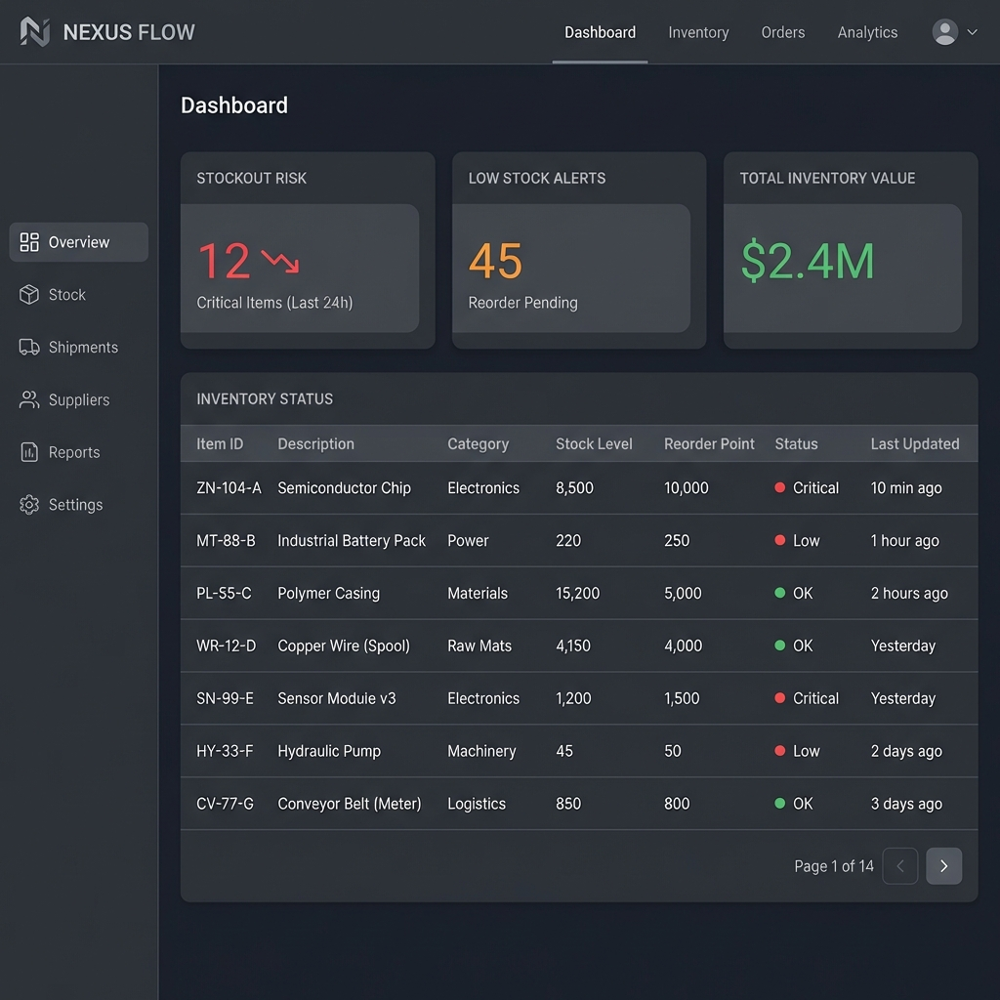

# Excel Projects Case Studies

This section details the advanced Excel methodologies used to solve specific business problems. Each project simulates a real-world scenario.

---

## 1. Sales Performance Dashboard

### 🎯 Business Goal
To unify scattered monthly sales logs into a single dynamic dashboard, enabling the Sales Director to identify underperforming regions and product lines instantly.

### 🛠 Tools & Functions Used
- **Power Query (Get & Transform)**: Automated the import and cleaning of multiple CSV source files. Removed duplicates and fixed data types.
- **Data Modeling**: Created relationships between the Sales Data table and Product/Region lookup tables.
- **Pivot Tables & Slicers**: Built interactive filters for Year, Region, and Category.
- **XLOOKUP**: Used to fetch dynamic pricing tiers based on volume.
- **Calculated Fields**: Created `Average Order Value (AOV)` and `MoM Growth %` directly within the Pivot Table.

### 💡 Key Insights
- Electronics account for **45%** of total revenue but have the highest return rate.
- The "North" region has seen a **12% dip** in Q3, suggesting a need for targeted marketing.

---

## 2. Financial Forecasting Model
*(Screenshot generic preview)*

### 🎯 Business Goal
To project Q4 revenue and expenses based on historical data and allow stakeholders to test "Best Case" vs "Worst Case" scenarios.

### 🛠 Tools & Functions Used
- **Scenario Manager**: Configured variables for `Growth Rate`, `COGS %`, and `OpEx Inflation`.
- **Advanced Formulas**:
    - `FORECAST.ETS`: Predicted future revenue based on seasonality.
    - `IF` & `AND`: Complex logic for conditional budget approval.
    - `INDEX-MATCH`: Retrieved historical variance data.
- **Conditional Formatting**: Highlighted variances >10% in red for immediate attention.

### 💡 Key Insights
- Keeping OpEx growth under **5%** is critical to hitting the net income target of $200k.

---

## 3. HR Attrition Dashboard

### 🎯 Business Goal
To investigate why the company is losing talent and identify "at-risk" departments.

### 🛠 Tools & Functions Used
- **CountIFS & SumIFS**: aggregated headcount and attrition numbers by department.
- **Data Validation**: Created dropdown lists for HR to filter by Job Role.
- **Charts**:
    - **Waterfall Chart**: To visualize net headcount change.
    - **Bar Chart**: Comparing Average Satisfaction Scores vs. Attrition Rate.

### 💡 Key Insights
- The **Sales Department** has the highest attrition (25%), highly correlated with low "Work-Life Balance" scores.

---

## 4. Inventory Management (Supply Chain)

### 🎯 Business Goal
To prevent stockouts by automating reorder alerts.

### 🛠 Tools & Functions Used
- **Dynamic Arrays (FILTER/SORT)**: Automatically generated a list of items below reorder point.
- **Conditional Formatting**: visually flagged items with `Stock < Demand`.
- **Formulas**:
    - `=(Demand / 30) * Lead Time`: Calculated optimal reorder points.

### 💡 Key Insights
- **12 Items** are currently at critical stock levels, primarily in the "Components" category.
